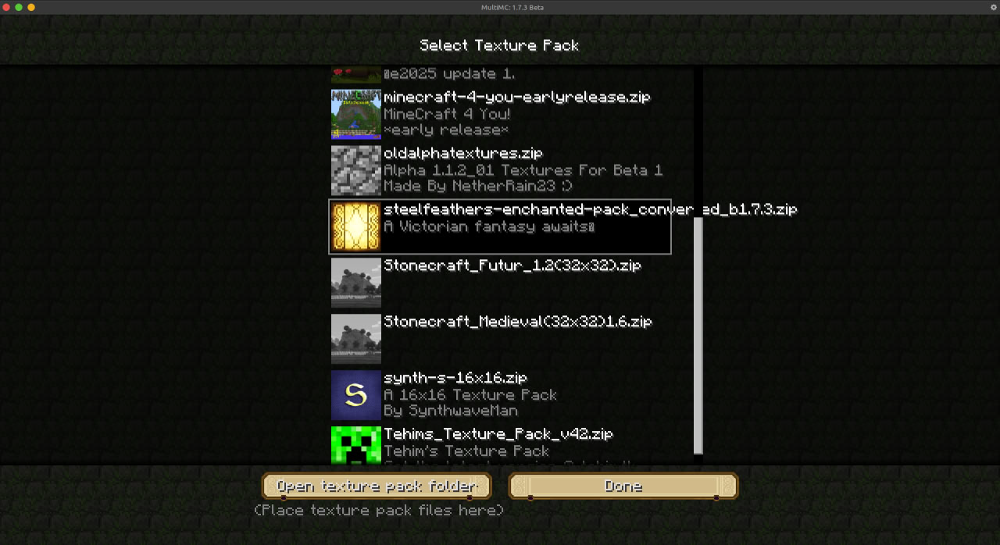
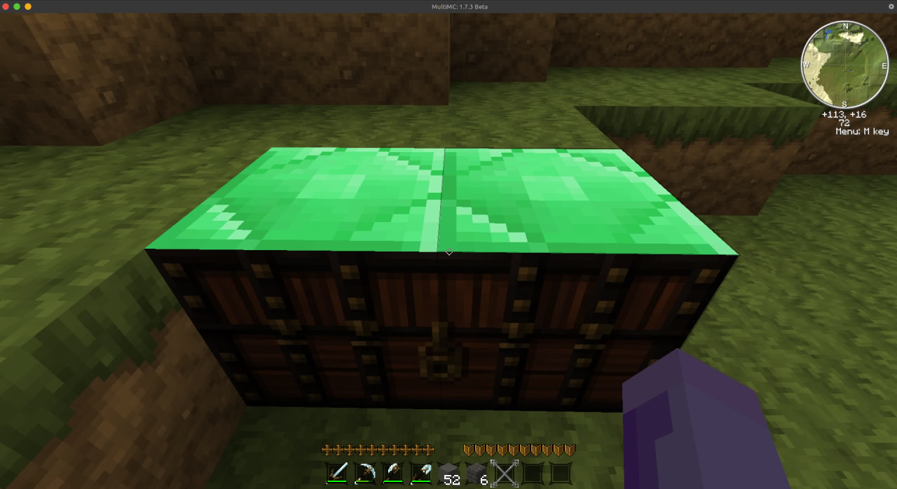

# Minecraft Resourse Pack to beta 1.7.3 Texture Pack converter

<a href="image-1.png" target="_blank">
    
</a>

A simple Python script that converts a Minecraft **resource pack** into a **texture pack compatible with beta 1.7.3**. It removes unsupported file formats and modern metadata so the resulting `.zip` can be loaded directly in your Beta 1.7.3 instance.

This script works quite well, but there are some flaws that will need to be corrected manually. Anyway, I think it's better than doing everything manually.

<a href="image.png" target="_blank">
    
</a>

---

## 🚀 Usage

1. Download or clone the script `main.py`  
2. Download resource pack you want to backport to beta 1.7.3, [like this one](https://ibifs.ddns.net/%D0%9F%D1%80%D0%BE%D1%87%D0%B5%D0%B5/steelfeathers-enchanted-pack_v1.6-1.2.5.zip) ***(This resource pack is not mine; all rights belong to its author)***.
3. Download a texture pack template for beta 1.7.3, [such as this one](https://ibifs.ddns.net/%D0%9F%D1%80%D0%BE%D1%87%D0%B5%D0%B5/legacypack-2025-32x.zip) ***(This texture pack is not mine; all rights belong to its author)***.
4. Run the script:
   ```bash
   python3 main.py modern-resourcepack.zip example_beta1.7.3_pack.zip
   ```
   Example:
   ```bash
   python main.py steelfeathers-enchanted-pack_v1.6-1.2.5.zip legacypack-2025-32x.zip
   ```
5. A file like `modern-resourcepack_converted_b1.7.3.zip` will be created.
6. Drop converted texturepack file into `texturepacks/` folder in your Minecraft Beta 1.7.3 instance, enable it in-game, and you’re good to go!

---

## How it works

- Reads a `resource-pack.zip` file made for Minecraft (For example 1.2.5)
- Filters out `assets/…` folders, `.mcmeta` and `.json` files (Beta doesn't support these)
- Writes the remaining files into a new `.zip` archive with the folder structure Beta expects (`terrain.png`, `gui/items.png`, etc.)
- Outputs a clean `.zip` you can drop directly into Beta 1.7.3 `texturepacks/` folder.
